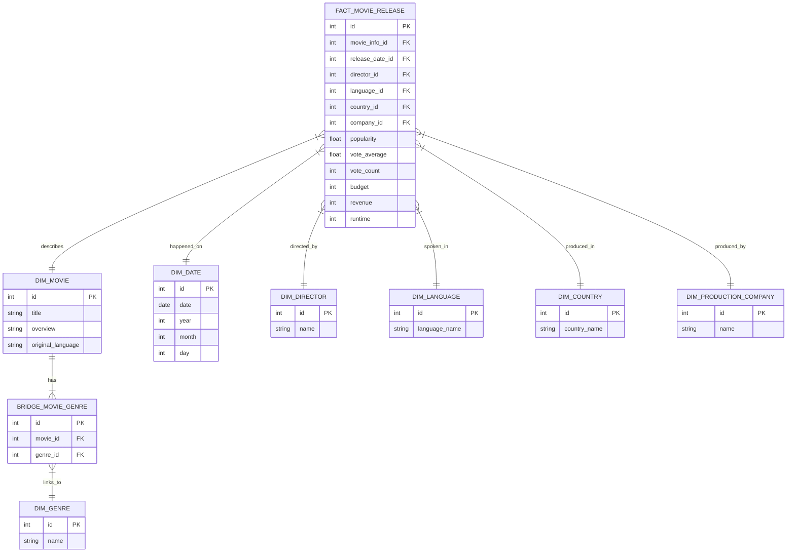

# System Architecture

## Overall Data Lake Organization

The Data Lake follows a Medallion Architecture, processing data from raw files to a refined Star Schema and finally indexing it for high-performance search.

## Layer 1: Bronze Layer (Raw Data)

The Bronze layer ingests raw data files. These files are kept in their original format to ensure data lineage and recoverability.

## Layer 2: Silver Layer (Refined Data)

In the Silver layer, data is cleaned, validated, and converted to columnar storage (Parquet) for efficient processing. Dictionaries and lists are parsed, and types are cast.

## Layer 3: Gold Layer (Star Schema)

The Gold layer is organized into a Star Schema optimized for analytical queries and transactional retrieval. It consists of a central Fact table surrounded by Dimension tables.

